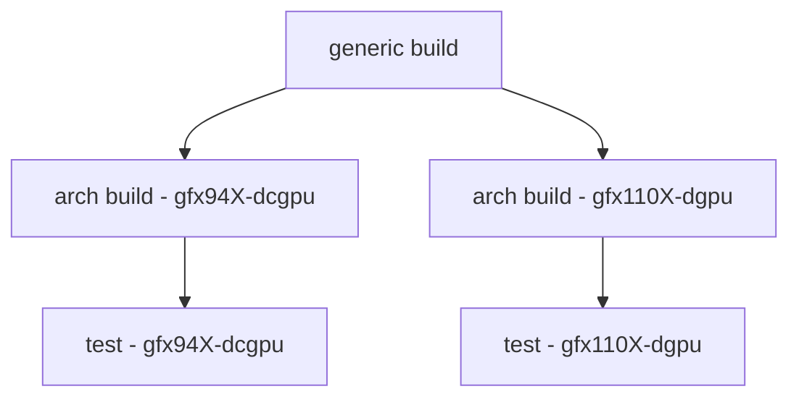
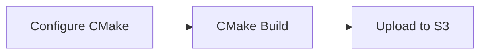
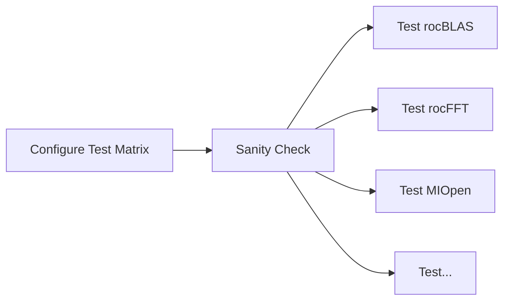
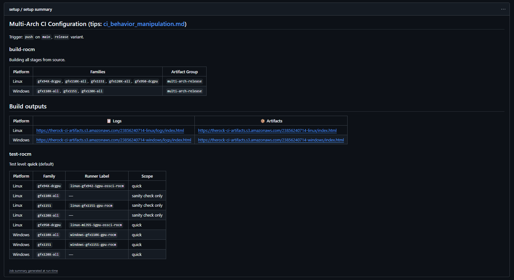

# CI Overview

This document provides an overview of how Continuous Integration (CI) works in TheRock, including the build → artifact → test pipeline. If you're migrating from MathCI or Jenkins-based workflows, this guide will help you understand TheRock's GitHub Actions-based approach.

## Quick Summary

TheRock CI follows this workflow:

1. **Build** ROCm from source via TheRock on CPU machines
1. **Upload** build artifacts to S3 (public-read buckets)
1. **Test** downloads and tests artifacts on GPU machines for testing

Instead of Jenkins and Groovy pipelines, TheRock uses **GitHub Actions** workflows defined in YAML files under `.github/workflows/`.

## CI Architecture

TheRock uses a multi-stage CI pipeline that splits the build into stages (foundation → compiler-runtime → math-libs, etc.) with dependency chaining. Below is a general diagram of the CI flow

Each stage runs as a separate job, uploads its artifacts and logs to S3, then downstream stages download and build on top of them. This allows for:

- **Parallelization:** Multiple GPU families can build math-libs simultaneously once compiler-runtime completes
- **Incremental builds:** Test-only runs can skip build stages by downloading pre-built artifacts
- **Flexibility:** Different stages can run on different runner types (e.g., CPU-only for build, GPU for tests)

**Key workflow files:**

- [`.github/workflows/multi_arch_ci.yml`](/.github/workflows/multi_arch_ci.yml) - Main entry point
  - [`.github/workflows/multi_arch_ci_linux.yml`](/.github/workflows/multi_arch_ci_linux.yml) - build rocm, test rocm, build rocm python, build pytorch for Linux
  - [`.github/workflows/multi_arch_build_portable_linux.yml`](/.github/workflows/multi_arch_build_portable_linux.yml) - Linux stages for "build rocm"
  - [`.github/workflows/multi_arch_ci_windows.yml`](/.github/workflows/multi_arch_ci_windows.yml) - build rocm, test rocm, build rocm python, build pytorch for Windows
  - [`.github/workflows/multi_arch_build_windows.yml`](/.github/workflows/multi_arch_build_windows.yml) - Windows stages for "build rocm"

## Build Phase

TheRock builds ROCm components from source and produces **artifacts** - archive slices of key components.

**What gets built:** Compiler (LLVM, etc.), core runtime (HIP, ROCr, etc.), math libraries (rocBLAS, rocFFT, etc.), ML libraries (MIOpen, etc.), media libraries (rocDecode, rocJPEG), and more.

**Artifact organization:** Each component is packaged into separate archives by sub-components (lib, run, dev, doc, test). See [artifacts.md](artifacts.md) for complete details on artifact structure and naming conventions.

## Artifact Storage and Distribution

### S3 Buckets

TheRock uses Amazon S3 for artifact storage. **All artifact buckets are public-read**, so no authentication is needed to download them.

See [s3_buckets.md](s3_buckets.md) for the complete bucket list and authentication details for uploads.

### Accessing Artifacts

Download artifacts using the [`fetch_artifacts.py`](https://github.com/ROCm/TheRock/blob/main/build_tools/fetch_artifacts.py) script, which handles fetching from S3 and extracting to the correct locations.

See [installing_artifacts.md](installing_artifacts.md) for detailed instructions on how the CI system installs artifacts:

- Finding GitHub run IDs
- Selecting components to download
- Installing from CI runs vs releases
- Using with different GPU families

## Test Phase

Tests are defined in [`fetch_test_configurations.py`](../../build_tools/github_actions/fetch_test_configurations.py), which generates a test matrix for parallel execution across multiple runners.

The test workflow downloads only the artifacts needed for the specific tests being run (e.g., `--blas --tests` for rocBLAS tests), installs them, and runs the test scripts in parallel.

**Test configuration:** Each test specifies which artifacts to download, timeout, platform support (Linux/Windows), and the test script to run.

**Test scripts:** Python scripts in [`build_tools/github_actions/test_executable_scripts/`](../../build_tools/github_actions/test_executable_scripts/) that work on both Linux and Windows. (shortly, these scripts will be migrated to their respective monorepos)

See [adding_tests.md](adding_tests.md) for how to add new tests to the CI pipeline.

## Common CI Tasks

### Viewing logs

At the start of a CI run, you will be able to see a GitHub Step Summary in the `Summary` page of the CI run.

As each build completes and uploads, you are able to find the index pages for artifacts and logs.

### Trigger a CI Run

CI runs on:

- [`workflow_dispatch`](https://github.com/ROCm/TheRock/actions/workflows/multi_arch_ci.yml) of `multi_arch_ci`
  - if a build is already available in CI, you are able to re-use those artifacts for test runs. See `ci_behavior_manipulation.md` doc below.
- `pull_request`
- `push` to `main` branch
- `schedule`: nightly runs

See [`ci_behavior_manipulation.md`](https://github.com/ROCm/TheRock/blob/main/docs/development/ci_behavior_manipulation.md) on ways to trigger and manipulate the CI

### Run Specific Tests

Use workflow dispatch with test labels to run only specific tests instead of the full suite.

See [test_filtering.md](test_filtering.md) for advanced filtering options.

### Add a New Test

1. Create test script in `build_tools/github_actions/test_executable_scripts/`
1. Add entry to `fetch_test_configurations.py`
1. Ensure artifact dependencies are configured in `install_rocm_from_artifacts.py`

See [adding_tests.md](adding_tests.md) for step-by-step instructions.

### Reproduce CI Failures Locally

Use the automated reproduction script to download artifacts and set up the same environment as CI.

See [test_environment_reproduction.md](test_environment_reproduction.md) for detailed instructions.

### Debug Build Failures

Build logs are uploaded to S3 and organized by stage and GPU family.

See [workflow_outputs.md](workflow_outputs.md) for the S3 layout structure and [github_actions_debugging.md](github_actions_debugging.md) for debugging techniques.

## Further Reading

### Build System

- [artifacts.md](artifacts.md) - Artifact organization and packaging
- [build_system.md](build_system.md) - CMake build architecture
- [dependencies.md](dependencies.md) - Dependency management
- [installing_artifacts.md](installing_artifacts.md) - Installing ROCm from artifacts

### Testing

- [adding_tests.md](adding_tests.md) - Adding new tests to CI
- [test_environment_reproduction.md](test_environment_reproduction.md) - Reproducing CI failures locally
- [test_filtering.md](test_filtering.md) - Running specific test subsets
- [test_debugging.md](test_debugging.md) - Debugging test failures

### Infrastructure

- [s3_buckets.md](s3_buckets.md) - S3 bucket organization and authentication
- [workflow_outputs.md](workflow_outputs.md) - CI output directory structure
- [github_actions_debugging.md](github_actions_debugging.md) - Debugging GitHub Actions
- [ci_behavior_manipulation.md](ci_behavior_manipulation.md) - Controlling CI behavior with labels and inputs

## Getting Help

- **Issues:** [TheRock GitHub Issues](https://github.com/ROCm/TheRock/issues)
- **Discussions:** Ask in your PR or ask in the [public Discord](https://discord.gg/R6Gf7Bfp4)
- **Documentation:** Check the [docs/development/](.) directory
