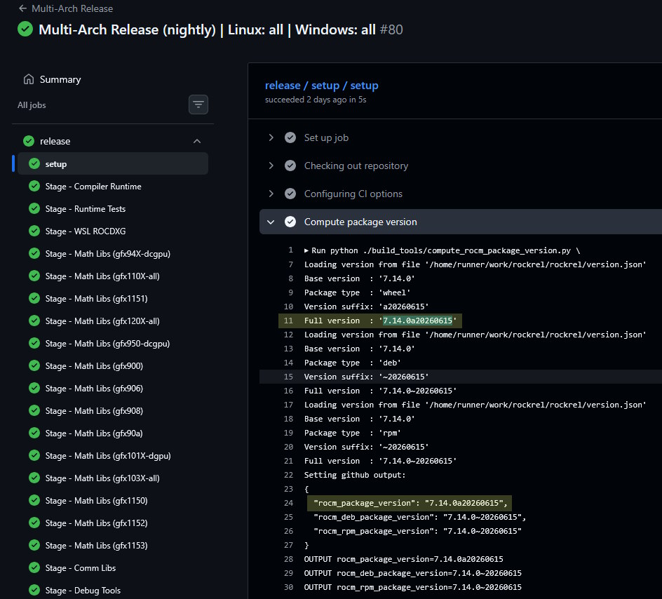
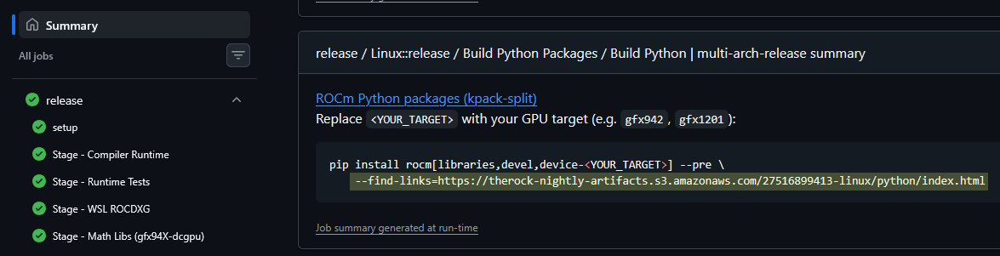
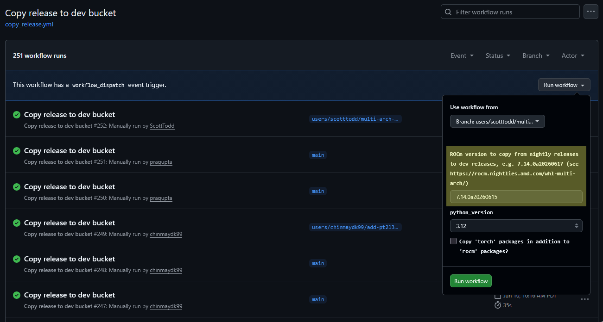
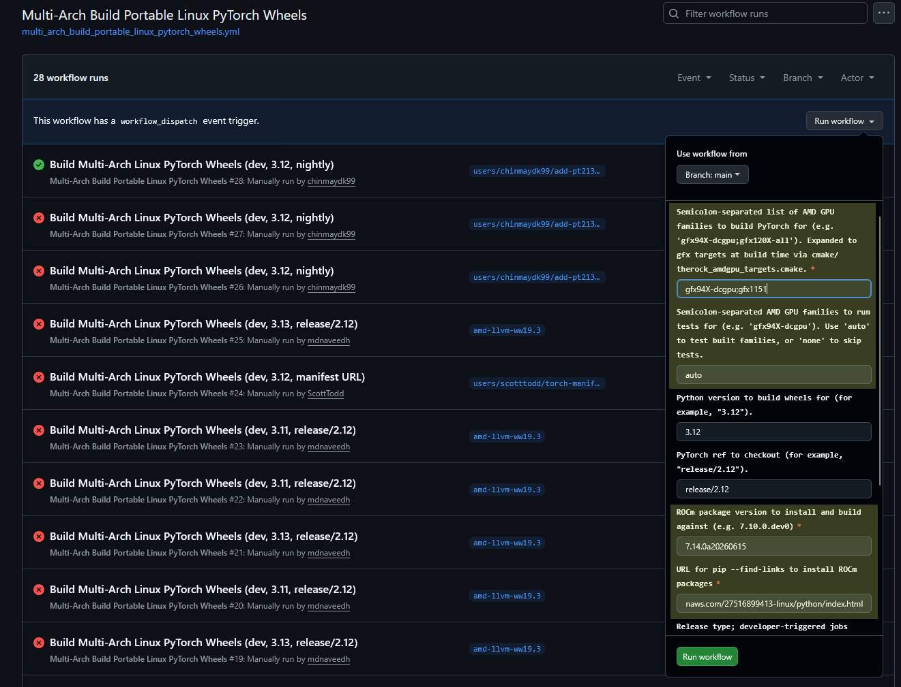

# GitHub Actions Debugging

Table of contents:

- [Testing release workflows](#testing-release-workflows)
- [Connecting to Kubernetes runners for interactive debugging](#connecting-to-kubernetes-runners-for-interactive-debugging)
- [Working effectively from forks](#working-effectively-from-forks)

## Testing release workflows

> [!IMPORTANT]
> All developer-triggered workflows should use the default "dev" release type.
>
> Nightly release workflows have been moved to the dedicated release
> https://github.com/ROCm/rockrel repository.
>
> Do **NOT** trigger "nightly" or "prereleases" manually unless you are
> absolutely sure that is justified and you have confirmed this with an
> infrastructure maintainer. The "nightly" release type pushes directly to
> user-visible channels documented in [`RELEASES.md`](/RELEASES.md) and should
> be treated as "prod"/"production". Do not test in prod!

### Testing PyTorch release workflows

Let's say we want to test
[`.github/workflows/multi_arch_build_portable_linux_pytorch_wheels.yml`](/.github/workflows/multi_arch_build_portable_linux_pytorch_wheels.yml),
which

1. Installs ROCm packages that have already been built
1. Builds `torch`, `torchvision`, `torchaudio`, and `triton` packages
1. Uploads the built packages to a release index
1. Runs tests on the packages

This should be performed using a "dev" release using the `therock-dev-python` S3
bucket and the package index https://rocm.devreleases.amd.com/.

Follow these steps:

1. Find a workflow run that produced packages you want to build against, like
   https://github.com/ROCm/rockrel/actions/runs/27516899413 from
   https://github.com/ROCm/rockrel/actions/workflows/multi_arch_release.yml.

1. Find the package version that produced, e.g. `7.14.0a20260615`:

   

1. Find the `--find-links` URL where those packages were uploaded, e.g.
   https://therock-nightly-artifacts.s3.amazonaws.com/27516899413-linux/python/index.html :

   

1. Copy the rocm packages for that version from the "nightly" release bucket to
   the "dev" release bucket by triggering
   https://github.com/ROCm/TheRock/actions/workflows/copy_release.yml.

   

1. Trigger
   https://github.com/ROCm/TheRock/actions/workflows/multi_arch_build_portable_linux_pytorch_wheels.yml
   from the branch you want and enter those inputs along with a list of GPU
   families to build and test for, e.g. `gfx94X-dcgpu;gfx1151`:

   

   That should start a workflow run like https://github.com/ROCm/TheRock/actions/runs/27648661730.

## Connecting to Kubernetes runners for interactive debugging

While we don't have anything as sophisticated as
https://github.com/pytorch/pytorch/wiki/Debugging-using-with-ssh-for-Github-Actions
yet, we do have the basic ability to SSH to some of our self-hosted GitHub
Actions runners while they are online. Once connected to a machine you can debug
by inspecting files, running commands, etc.

> [!NOTE]
> This procedure only works for authorized users (AMD employees with access
> to the cloud projects).

1. Install `az` and `kubectl` following the installation instructions:

   - https://learn.microsoft.com/en-us/cli/azure/install-azure-cli?view=azure-cli-latest
   - https://kubernetes.io/docs/tasks/tools/#kubectl

1. Authenticate with Azure and get aks credentials:

   ```
   az login
   az account set --subscription <subscription_id>
   az aks get-credentials --resource-group <resource_group_name> --name <aks_name>
   ```

   (Ask around if you are unsure of which subscription, resource group, and
   name to use)

1. Optionally edit the workflow file you want to debug to include a pause so you
   won't be kicked off while still debugging:

   ```yml
   - name: Suspend for interactive debugging
     if: ${{ !cancelled() }}
     run: sleep 21600
   ```

1. Trigger the workflow you want to test, if not already running

1. Look for the runner name in the `Set up job` step:

   ```
   Current runner version: '2.324.0'
   Runner name: 'azure-windows-scale-rocm-2jjjw-runner-7htbh'
   Machine name: 'AZURE-WINDOWS-S'
   ```

1. Connect to the runner, choosing the appropriate shell for the operating
   system:

   ```
   kubectl exec -it azure-windows-scale-rocm-2jjjw-runner-7htbh  -n arc-runners -- powershell
   ```

### Tips for debugging on Windows runners

Relevant directories:

| Directory                                    | Description                                                                           |
| -------------------------------------------- | ------------------------------------------------------------------------------------- |
| `C:\home\runner\_work\`                      | Files related to the current job                                                      |
| `C:\home\runner\_work\TheRock\TheRock\`      | Source checkout                                                                       |
| `C:\home\runner\_work\_tool\Python\3.12.10\` | Python installs for [`actions/setup-python`](https://github.com/actions/setup-python) |
| `B:\build\`                                  | CMake build directory                                                                 |

To monitor CPU usage a tool like
[btop4win](https://github.com/aristocratos/btop4win) can be installed and run:

```powershell
$progresspreference="SilentlyContinue"; Invoke-WebRequest https://github.com/aristocratos/btop4win/releases/download/v1.0.4/btop4win-x64.zip -OutFile btop4win-x64.zip; Expand-Archive btop4win-x64.zip -Force; $env:PATH="$env:PATH;$pwd\btop4win-x64\btop4win\"; btop4win.exe
```

To re-run CMake build commands:

> [!IMPORTANT]
> The choices of shell (bash/powershell/cmd) are very important here. If commands
> are run from the wrong shell, CMake configure may fail in confusing ways.

```bash
# Assumed starting under powershell

# Setup MSVC under cmd
cmd
"C:/Program Files/Microsoft Visual Studio/2022/Community/VC/Auxiliary/Build/vcvars64.bat"

# Switch to bash, move into the source directory
bash
cd _work/TheRock/TheRock

# Optionally set environment variables
export TEATIME_FORCE_INTERACTIVE=1

# Set up ccache environment (CI does this in a separate step)
eval "$(./build_tools/setup_ccache.py)"

# Copy the configure command from the "Configure Projects" step
cmake -B "B:/build" -GNinja . -DTHEROCK_AMDGPU_FAMILIES=gfx110X-all -DCMAKE_C_COMPILER_LAUNCHER=ccache -DCMAKE_CXX_COMPILER_LAUNCHER=ccache -DTHEROCK_VERBOSE=ON -DBUILD_TESTING=ON -DCMAKE_C_COMPILER="C:/Program Files/Microsoft Visual Studio/2022/Community/VC/Tools/MSVC/14.44.35207/bin/Hostx64/x64/cl.exe" -DCMAKE_CXX_COMPILER="C:/Program Files/Microsoft Visual Studio/2022/Community/VC/Tools/MSVC/14.44.35207/bin/Hostx64/x64/cl.exe" -DCMAKE_LINKER="C:/Program Files/Microsoft Visual Studio/2022/Community/VC/Tools/MSVC/14.44.35207/bin/Hostx64/x64/link.exe" -DTHEROCK_BACKGROUND_BUILD_JOBS=4

# Build CMake targets
# You could also run buildctl.py here to enable/disable specific subprojects
cmake --build "B:\build" --target MIOpen+expunge
cmake --build "B:\build" --target MIOpen+dist
```

### Issues with debugging notes

- https://github.com/ROCm/TheRock/issues/840: Builds hitting 6 hour timeouts
- https://github.com/ROCm/TheRock/issues/1407: Flaky compiler crashes during builds

## Working effectively from forks

The structure outlined at
[Overall build architecture](./development_guide.md#overall-build-architecture)
shows how [artifacts](./artifacts.md) produced by source builds can be leveraged
for package builds such as those for [Python packaging](./../packaging/python_packaging.md).

This modular and pipelined build architecture is particularly useful when
developing and debugging packaging workflows, since the complete build/release
pipeline can take several hours sharded across multiple types of build and test
machines.

The [`.github/workflows/build_windows_python_packages.yml`](/.github/workflows/build_windows_python_packages.yml)
and [`.github/workflows/build_portable_linux_python_packages.yml`](.github/workflows/build_portable_linux_python_packages.yml)
workflows are both runnable from personal repository forks. By default they
download artifacts from a recent workflow run in the https://github.com/ROCm/TheRock
repository. You can customize where artifacts are downloaded from by setting
the `artifact_github_repo` and `artifact_run_id` workflow inputs.

Eventually we would like for all ROCm CI and CD workflow runs to produce and
upload artifacts in a compatible schema so that more workflows (e.g. producing
native Linux or Windows packages, running framework tests, etc.) can extend this
work.
