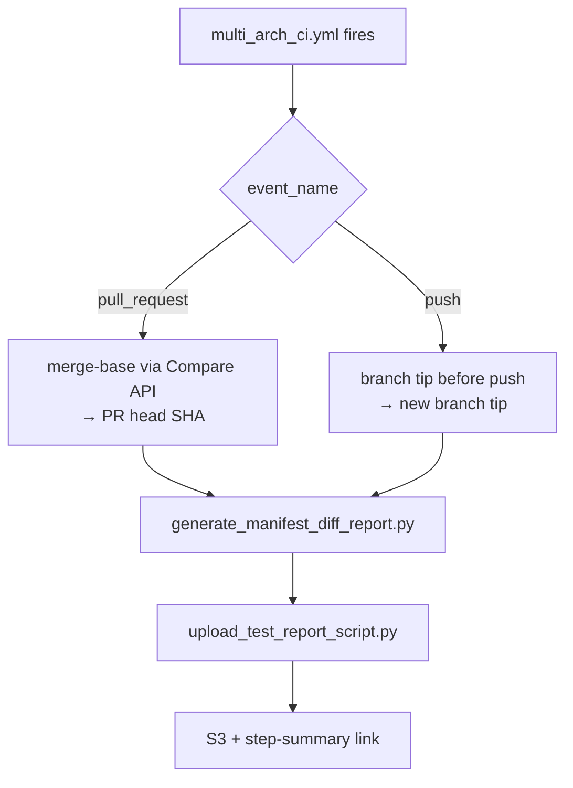

# Manifest Diff Report

The **manifest diff report** is a CI tool that summarizes which TheRock submodule SHAs changed between two commits. It runs automatically on every multi-arch CI run for `pull_request` and `push` events, and can also be invoked on demand via direct `workflow_dispatch` of [`manifest-diff.yml`](../../.github/workflows/manifest-diff.yml) or locally on the command line.

## Summary

TheRock is a CMake super-project pinned to a small set of top-level git submodules (`.gitmodules`), two of which (`rocm-libraries`, `rocm-systems`) are themselves superrepos containing further ROCm components under `projects/` and `shared/`. When a change in TheRock or in any of those upstream repos lands, it can be non-obvious which pointer(s) actually moved. The manifest diff report answers that question: for two TheRock commits (a **start** and an **end**), it walks the manifest produced by `generate_therock_manifest.py` — top-level submodules plus superrepo components — and produces an HTML page listing the new commit range on each one, with links back to the upstream repos.

The report is generated by [`build_tools/generate_manifest_diff_report.py`](../../build_tools/generate_manifest_diff_report.py) and uploaded to S3 by the [`manifest-diff.yml`](../../.github/workflows/manifest-diff.yml) reusable workflow.

## How it runs in CI

On `pull_request` and `push` events, [`multi_arch_ci.yml`](../../.github/workflows/multi_arch_ci.yml) invokes [`manifest-diff.yml`](../../.github/workflows/manifest-diff.yml) as a parallel sibling job. The reusable workflow auto-derives the **start** and **end** refs from the event payload — PR runs use the merge-base against the PR's base branch (rebase-safe via the GitHub Compare API); push runs use the branch tip before and after the push.

The sibling job is wired only for those two events because they're the ones whose payloads carry the implicit refs. A manual `workflow_dispatch` of `multi_arch_ci.yml` skips it; for ad-hoc runs, dispatch [`manifest-diff.yml`](../../.github/workflows/manifest-diff.yml) directly — it exposes the full ref input surface.

### Failure behavior

The reusable workflow sets `continue-on-error: ${{ github.event_name != 'workflow_dispatch' }}`:

- **Under CI** (`push` / `pull_request` from `multi_arch_ci.yml`): non-blocking — a script or API failure shows yellow on the run summary and never gates the build/test jobs running in parallel.
- **Under direct `workflow_dispatch`** of `manifest-diff.yml`: strict — real script regressions surface red, since the only reason to dispatch this workflow manually is to validate the script.

The upload and AWS-credentials steps are both gated on the report-generation step succeeding, so a failed report produces only the real error rather than a follow-on "no such file" upload failure.

### Where the report lives

The report is uploaded to S3 by [`upload_test_report_script.py`](../../build_tools/github_actions/upload_test_report_script.py) and linked from the job's step-summary tab. S3 layout, bucket selection, and credential routing (OIDC for base-repo, baseline credentials for fork PRs) are owned by [`workflow_outputs.md`](workflow_outputs.md) and [`s3_buckets.md`](s3_buckets.md).

## Running it manually

### `workflow_dispatch`

Trigger `TheRock Manifest Diff Report` on the [Actions page](https://github.com/ROCm/TheRock/actions/workflows/manifest-diff.yml). `end_ref` is required; pick exactly one of `pr_base_ref`, `find_last_run`, or `start_ref` to resolve the start (precedence: `pr_base_ref` > `find_last_run` > `start_ref`). See the `description:` fields on the inputs in [`manifest-diff.yml`](../../.github/workflows/manifest-diff.yml) for the authoritative reference.

### Local CLI

See [`generate_manifest_diff_report.py`](../../build_tools/generate_manifest_diff_report.py) and run with `--help` for usage. Set `GITHUB_TOKEN` (any token with `public_repo` read scope) before running to avoid GitHub's 60 req/hr unauthenticated rate limit.

## Out of scope

External orchestrator workflows in `rocm-libraries` / `rocm-systems` that drive TheRock's reusable workflows via `setup_multi_arch.yml`'s `external_repo` input, and the rockrel release-driver flow (via `multi_arch_release.yml`), currently produce no manifest-diff; extending the report to those callers is tracked in #5219.

## Code map

| File                                                                                                                       | Role                                                                     |
| -------------------------------------------------------------------------------------------------------------------------- | ------------------------------------------------------------------------ |
| [`.github/workflows/manifest-diff.yml`](../../.github/workflows/manifest-diff.yml)                                         | Reusable workflow: derives refs from caller event, runs script, uploads. |
| [`.github/workflows/multi_arch_ci.yml`](../../.github/workflows/multi_arch_ci.yml)                                         | Hosts the `manifest_diff` sibling job that calls `manifest-diff.yml`.    |
| [`build_tools/generate_manifest_diff_report.py`](../../build_tools/generate_manifest_diff_report.py)                       | Resolves start/end SHAs, walks submodules, renders the HTML report.      |
| [`build_tools/github_actions/github_actions_api.py`](../../build_tools/github_actions/github_actions_api.py)               | `gha_query_last_workflow_run()` shared helper used by `--find-last-run`. |
| [`build_tools/github_actions/upload_test_report_script.py`](../../build_tools/github_actions/upload_test_report_script.py) | S3 upload + step-summary link (shared with test reports).                |

## Related

- [`ci_overview.md`](ci_overview.md) — overall multi-arch CI architecture.
- [`workflow_outputs.md`](workflow_outputs.md) — S3 layout used by the upload step.
- [`github_actions_debugging.md`](github_actions_debugging.md) — debugging GitHub Actions runs.
